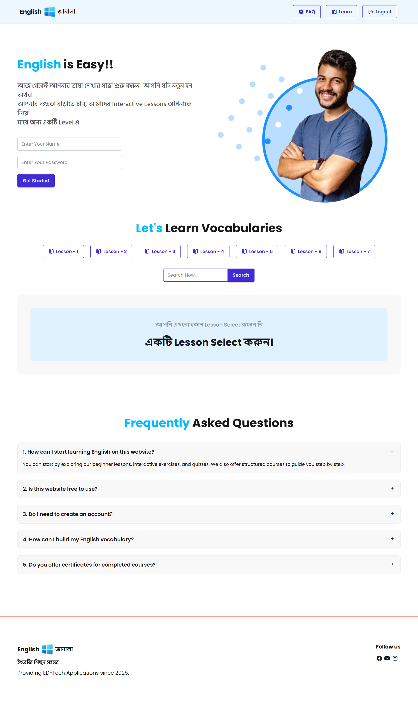

<div align="center">


   # 📚 English Vocabulary Learning Platform
### *Master English Vocabulary with an Interactive & Engaging Experience.*

[]()
[]()
[]()
[]()
[]()

*An interactive and modern web-based platform designed to help users learn and master English vocabulary. This project combines a clean user interface with functional logic to create an engaging educational tool.*

</div>

---

### 📸 Project Preview


---

### 📝 Project Overview
This platform is built for students and language enthusiasts. It features a structured way to explore new words, utilizing custom scripts for interactivity and Tailwind CSS for a professional, responsive layout.

### ✨ Key Features
- **Dynamic Word Display:** Powered by custom JavaScript for a smooth user experience.
- **Modern Responsive Design:** Crafted with **Tailwind CSS** for seamless viewing on all devices.
- **Asset Management:** Organized folder structure for `scripts`, `assets`, and `styles`.
- **Clean UI:** Minimalist approach to focus purely on learning content.
- **Fast Performance:** Pure frontend implementation ensuring instant load times.

### 🛠️ Technology Stack
- **HTML5:** For semantic and accessible web structure.
- **CSS3 & Tailwind CSS:** Using utility-first classes and custom `style.css` for polished design.
- **JavaScript (Vanilla):** Custom scripts located in the `/scripts` folder for application logic.

### 📦 Dependencies & Tools
- [Tailwind CSS](https://tailwindcss.com/) - For rapid and modern styling.
- [Google Fonts](https://fonts.google.com/) - Integrated for better readability.
- [Lucide Icons / FontAwesome] - (If used in your assets/scripts).

### 🚀 How to Run Locally
1. **Clone the repository:**
   ```bash
   git clone [https://github.com/fireflyurmi/english-vocabulary-learning-platform.git](https://github.com/fireflyurmi/english-vocabulary-learning-platform.git)
